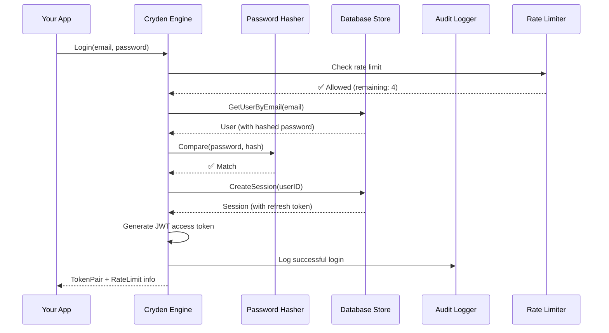

# CrydenSync 🔐

<div align="center">

**Embeddable authentication engine for Go — offline-first, framework-agnostic.**

[](https://golang.org/)
[](https://pkg.go.dev/github.com/crydensync/cryden)
[](https://goreportcard.com/report/github.com/crydensync/cryden)
[](https://opensource.org/licenses/MIT)
[](https://github.com/crydensync/cryden/releases)
[](https://github.com/crydensync/cryden/releases)
[](https://github.com/crydensync/cryden/stargazers)
[](https://github.com/crydensync/cryden/actions/workflows/test.yml)
[](https://codecov.io/gh/crydensync/cryden)

</div>
## 🎯 The Problem

Authentication is not business logic, yet every project rewrites it. Developers face three painful choices:

1. **Rewrite auth logic** for every project — risky, inconsistent, time-consuming
2. **Use hosted auth services** — vendor lock-in, users aren't yours, requires internet
3. **Use framework-specific tools** — tied to Express, Django, Next.js — not reusable

## 💡 The Solution

CrydenSync is an **embeddable authentication engine** that gives you a standard, reusable auth system you control:

```go
package main

import (
    "context"
    "fmt"
    "log"
    
    "github.com/crydensync/cryden"
)

func main() {
    // Create context
    ctx := context.Background()
    
    // 1. Create engine (in-memory storage - perfect for testing)
    engine := cryden.New()
    fmt.Println("✅ Engine created")
    
    // 2. Sign up a new user
    email := "alice@example.com"
    password := "SecurePass123"
    
    user, err := cryden.SignUp(ctx, engine, email, password)
    if err != nil {
        log.Fatalf("❌ SignUp failed: %v", err)
    }
    fmt.Printf("✅ User created: %s (%s)\n", user.ID, user.Email)
    
    // 3. Login
    tokens, rateLimit, err := cryden.Login(ctx, engine, email, password)
    if err != nil {
        log.Fatalf("❌ Login failed: %v", err)
    }
    fmt.Printf("✅ Login successful!\n")
    fmt.Printf("   Access Token: %s...\n", tokens.AccessToken[:50])
    fmt.Printf("   Refresh Token: %s...\n", tokens.RefreshToken[:50])
    fmt.Printf("   Rate Limit Remaining: %d\n", rateLimit.Remaining)
    
    // 4. Verify token
    userID, err := cryden.VerifyToken(engine, tokens.AccessToken)
    if err != nil {
        log.Fatalf("❌ Token verification failed: %v", err)
    }
    fmt.Printf("✅ Token verified for user: %s\n", userID)
    
    // 5. Logout
    err = cryden.Logout(ctx, engine, tokens.RefreshToken)
    if err != nil {
        log.Fatalf("❌ Logout failed: %v", err)
    }
    fmt.Println("✅ Logout successful")
    
    // 6. Try to use logged out token (should fail)
    _, err = cryden.RefreshToken(ctx, engine, tokens.RefreshToken)
    if err != nil {
        fmt.Printf("✅ Expected error after logout: %v\n", err)
    }
    
    fmt.Println("\n🎉 All tests passed!")
}  
  
```
[View full example →](examples/complete/main.go)

✨ Features

✅ v1.0.0 (Current)

· Email/password authentication — Secure, bcrypt hashed
· JWT access tokens — Short-lived, stateless
· Opaque refresh tokens — Stored in DB for revocation
· Rate limiting — Per IP with headers (X-RateLimit-*)
· Audit logging — Track every auth event
· Session management — Logout single device or all devices
· Multiple storage backends — Memory, SQLite, PostgreSQL, MongoDB
· Complete test suite — 90%+ coverage
· Offline-first — Works without internet, SQLite by default

🚧 Coming Soon

Feature Status Target
gRPC API 🚧 Planned v1.1.0
CLI tool (csax) 🚧 Planned v1.1.0
Language SDKs (JS, Python, PHP) 🚧 Planned v1.2.0
MFA/2FA (TOTP) 📅 Future v1.3.0
Magic Links 📅 Future v1.3.0
WebAuthn/Passkeys 📅 Future v2.0.0

📦 Installation

```bash
go get github.com/crydensync/cryden@v1.0.0
```

```markdown
## 🧪 Local Development

Want to hack on CrydenSync itself? Use it locally in your own app:

```bash
git clone https://github.com/crydensync/cryden.git
cd your-app
go mod edit -replace github.com/crydensync/cryden=../cryden
go run main.go  # Uses your local version!
```

📚 Full Local Dev Guide → (CrydenSync web docs soon)


📖 Documentation

Section Description
📚 Getting Started 60-second working auth
🎯 Philosophy Why Cryden exists
🏗️ Architecture How it works
📐 Design Decisions Why we built it this way
🔧 Guide Installation, config, middleware, testing
🔌 Adapters Interface implementations
📘 API Reference Complete API docs
💡 Examples Copy-paste working code

🧪 Testing

CrydenSync is designed for maximum testability:

```go
func TestLogin(t *testing.T) {
    engine := cryden.New()  // In-memory storage
    
    // Optional: Use mock hasher for faster tests
    engine.WithHasher(&core.MockHasher{})
    
    // Optional: Disable rate limiting
    engine.WithRateLimiter(&core.NoopRateLimiter{})
    
    ctx := context.Background()
    cryden.SignUp(ctx, engine, "test@example.com", "pass")
    tokens, _, err := cryden.Login(ctx, engine, "test@example.com", "pass")
    
    assert.NoError(t, err)
    assert.NotEmpty(t, tokens.AccessToken)
}
```

📖 Testing Guide →

🔧 Configuration

```go
// With SQLite persistence
engine, err := cryden.WithSQLite("users.db")

// With custom JWT secret (required in production)
cryden.WithJWTSecret(engine, os.Getenv("JWT_SECRET"))

// With custom rate limiter
engine.WithRateLimiter(redis.NewRateLimiter())

// With custom audit logger
engine.WithAuditLogger(file.NewAuditLogger("auth.log"))
```

📊 Storage Backends

Backend Status Use Case
Memory ✅ Stable Testing
SQLite ✅ Stable Offline-first, development
PostgreSQL ✅ Stable Production
MongoDB ✅ Stable Document stores
MySQL 🚧 Planned v1.1.0
Redis 🚧 Planned v1.1.0 (rate limiting)

## 📛 About the Name

**CrydenSync** is the full name of the project, but the Go package is simply `cryden` for brevity.

```go
import "github.com/crydensync/cryden"  // Notice: crydensync/cryden

auth := cryden.New()  // Short and sweet!
``````

✅ Perfect! Let's add a "How It Works" section to your README.md

Add this after Features:

```markdown
## 🔧 How CrydenSync Works (Under the Hood)

### The Authentication Flow

When a user logs in, here's what happens:



### The Dual-Token System

```
┌─────────────────────────────────────────────────────┐
│                    CLIENT SIDE                        │
├─────────────────────────────────────────────────────┤
│  Access Token (JWT)  │  Refresh Token (Opaque)       │
│  • Short-lived (15m) │  • Long-lived (7d)            │
│  • Stateless         │  • Stored in database         │
│  • Contains user ID  │  • Can be revoked             │
│  • No DB lookup      │  • Supports "logout all"      │
└─────────────────────────────────────────────────────┘
```

### Why This Design?

#### JWT for Speed
```go
// API can verify without database lookup
claims, _ := cryden.VerifyToken(token)
userID := claims.UserID // Fast!
```

#### Opaque Tokens for Control
```go
// Logout all devices = delete all refresh tokens
cryden.LogoutAll(ctx, engine, userID) // Instant revocation
```

### The Interface Architecture

```
┌─────────────────────────────────────────────────────┐
│                    YOUR APPLICATION                    │
├─────────────────────────────────────────────────────┤
│                    cryden.New()                        │
├─────────────────────────────────────────────────────┤
│  ┌─────────────────────────────────────────────────┐
│  │              CRYDEN ENGINE                        │
│  │  • SignUp, Login, Logout                         │
│  │  • Token generation & validation                  │
│  │  • Session management                             │
│  └─────────────────────────────────────────────────┘
├─────────────────────────────────────────────────────┤
│                    INTERFACES                          │
├──────────────┬──────────────┬──────────────────────┤
│  UserStore   │ SessionStore │ Hasher               │
│  • Create    │ • Create     │ • Compare            │
│  • GetByEmail│ • GetByToken │ • Hash               │
│  • Update    │ • Revoke     │                      │
│  • Delete    │ • RevokeAll  │                      │
├──────────────┼──────────────┼──────────────────────┤
│  RateLimiter │ AuditLogger  │ (More adapters...)   │
│  • Allow     │ • Log        │                      │
│  • Reset     │              │                      │
└──────────────┴──────────────┴──────────────────────┘
```

### Storage Adapters in Action

```go
// Same code works with ANY database!
type UserStore interface {
    GetByEmail(email string) (*User, error)
    Create(user *User) error
    // ...
}

// Memory adapter (testing)
type MemoryUserStore struct {
    users map[string]*User
}

// SQLite adapter (offline)
type SQLiteUserStore struct {
    db *sql.DB
}

// PostgreSQL adapter (production)
type PostgresUserStore struct {
    db *sql.DB
}

// MongoDB adapter (NoSQL)
type MongoUserStore struct {
    coll *mongo.Collection
}
```

### The Audit Trail

Every action is logged for security:

```json
{
  "timestamp": "2026-03-10T10:30:00Z",
  "user_id": "usr_123",
  "action": "SIGN_IN_SUCCESS",
  "ip_address": "192.168.1.100",
  "user_agent": "Mozilla/5.0...", // comming soon
  "status": "SUCCESS"
}
```

### Rate Limiting with Headers

```http
HTTP/1.1 200 OK
X-RateLimit-Limit: 5
X-RateLimit-Remaining: 3
X-RateLimit-Reset: 45
```

Frontend can show: "3 attempts remaining. Try again in 45 seconds."

### Session Management
# **Planed for v1.1.0

```
┌─────────────────────────────────────────────────────┐
│                    USER SESSIONS                      │
├─────────────────────────────────────────────────────┤
│  Device: iPhone 15                                   │
│  Location: Lagos, Nigeria                            │
│  Last active: 2 minutes ago                          │
│  Status: ● Active                                     │
├─────────────────────────────────────────────────────┤
│  Device: MacBook Pro                                  │
│  Location: Lagos, Nigeria                            │
│  Last active: 2 hours ago                             │
│  Status: ● Active                                     │
└─────────────────────────────────────────────────────┘
                          [Logout All Devices]
```

### Security Layers

```
┌─────────────────────────────────────────────────────┐
│                    SECURITY LAYERS                    │
├─────────────────────────────────────────────────────┤
│  Layer 1: Rate Limiting                               │
│  → Prevents brute force attacks                       │
│  → 5 attempts per minute per IP                       │
├─────────────────────────────────────────────────────┤
│  Layer 2: Password Hashing                             │
│  → bcrypt with salt                                    │
│  → Argon2id coming in v1.1                             │
├─────────────────────────────────────────────────────┤
│  Layer 3: JWT Signing                                  │
│  → HMAC-SHA256 with secret                             │
│  → Short expiration (15m)                              │
├─────────────────────────────────────────────────────┤
│  Layer 4: Refresh Token Rotation                       │
│  → New token on every refresh                          │
│  → Old tokens revoked immediately                      │
├─────────────────────────────────────────────────────┤
│  Layer 5: Audit Logging                                │
│  → Every action tracked                                │
│  → Suspicious activity detection (future)              │
└─────────────────────────────────────────────────────┘
```

### The Complete Request Lifecycle

```
1. Request arrives
   ↓
2. Rate Limiter checks IP
   ↓
3. User credentials validated
   ↓
4. Password compared (constant time)
   ↓
5. Session created in database
   ↓
6. JWT access token generated
   ↓
7. Audit log entry created
   ↓
8. Response with tokens + rate limit headers
   ↓
9. Frontend stores tokens securely
```

### Why This Matters for Your Users

```go
// Your users get:
// ✅ Security (bcrypt, rate limiting)
// ✅ Control (logout all devices)
// ✅ Visibility (audit logs, session list)
// ✅ Flexibility (any database)
// ✅ Freedom (no vendor lock-in)
```

## 🎯 The Bottom Line

CrydenSync isn't just an auth library — it's a **complete authentication infrastructure** that you control completely.

- **You own the data**
- **You choose the database**
- **You control the security**
- **You keep your users**

No vendor lock-in. No hidden costs. Just auth that works everywhere.

## 🔒 Security Notes v1.0.0

### ✅ Implemented
- Password hashing with bcrypt
- JWT signing with HMAC-SHA256
- Rate limiting to prevent brute force
- Audit logging for all auth events

### ⚠️ Planned for v1.1.0
- Refresh token hashing in database
- Session token hashing
- Device fingerprinting
- Argon2id hasher option

### Future Security Enhancements
- Email verification (v1.1)
- Password reset flow (v1.1)
- MFA/2FA (v1.2)
- Login notifications (v1.2)
- Breached password detection (v1.2)

### 🔐 Best Practices
1. Always use HTTPS in production
2. Set strong JWT secrets via environment variables
3. Monitor audit logs for suspicious activity
4. Add email verification before sensitive actions

🤝 Contributing

We welcome contributions! See CONTRIBUTING.md for:

· Code of Conduct
· Development setup
· Pull request process
· Coding standards

📄 License

MIT © Crydensync

⭐ Support

If you find Cryden useful, please star the repo!

## 📊 Project Stats

| Metric | Value |
|--------|-------|
| ⭐ Stars | [](https://github.com/crydensync/cryden/stargazers) |
| 📥 Downloads | [](https://github.com/crydensync/cryden/releases) |
| 🏷️ Version | [](https://github.com/crydensync/cryden/releases) |
| ✅ Build | [](https://github.com/crydensync/cryden/actions/workflows/test.yml) |
| 📚 Docs | [](https://pkg.go.dev/github.com/crydensync/cryden) |

## 🗺️ Roadmap

### Current: v1.0.0 (March 2026)
✅ Core authentication with email/password.                  ✅ JWT + refresh tokens.         ✅ Rate limiting & audit logs.    ✅ Multiple databases (SQLite, PostgreSQL, MongoDB)

### Coming in v1.1.0 (Q2 2026)
🚀 CLI tool (`csax`)
📱 Device tracking (IP, user agent, last seen)
🔐 Argon2id hasher
⚡ Redis rate limiter
le audit logger
🐬 MySQL support

### Coming in v1.2.0 (Q3 2026)
🔌 gRPC API
🌐 Language SDKs (JS, Python, PHP)
🔔 Webhooks
🔄 Migration tools (Clerk, Auth0, Supabase)

### Coming in v1.3.0 (Q4 2026)
🔐 Multi-Factor Authentication (TOTP)
📧 Magic links & passwordless
🔑 WebAuthn / Passkeys
🌍 Social login (OAuth2)

### Future (2027+)
☁️ Optional cloud sync
📊 Enterprise features
🔌 More adapters
🚀 v2.0.0 (breaking changes if needed)

[View full roadmap →](docs/roadmap.md)

---

<div align="center">
  <sub>Built with ❤️ in Africa · Own your users, not vendor lock-in</sub>
</div>
